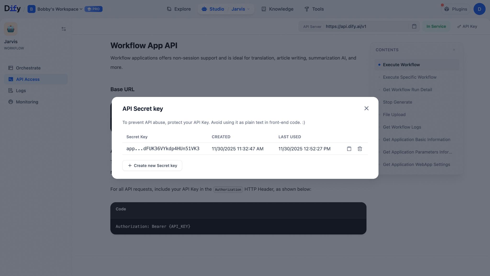

<p align="center">
  
</p>

<p align="center">
  <strong>⚡ A Futuristic Browser HUD Inspired by Iron Man's JARVIS</strong><br>
  <sub>Gesture + Voice Control + Satellite Map + Hand Tracking + AI Agent</sub>
</p>

---

# JARVIS Amber Protocol HUD (Mk. XXII)

一个基于浏览器的 **全息 HUD 交互系统**，融合了实时视觉、手势追踪、语音识别、卫星地图与 AI Agent 能力，构建沉浸式的 JARVIS 式人机界面。

🎬 **演示视频（Bilibili）：**  
https://www.bilibili.com/video/BV1u6SJBhELj/
---

# 📦 项目版本说明 | Versions

本项目包含 **两个可运行版本**：分别用于展示 HUD 效果与接入 AI 功能。

---

## 1. jarvis-starter（基础 HUD 版本）

纯前端 HUD 功能，包括：

- 实时摄像头 HUD（Amber 风格滤镜）
- 手势识别（MediaPipe Hands）
- 卫星地图导航（Leaflet + Esri 全球影像）
- 基础语音指令（英文）
- 天气扫描（Open-Meteo）

**入口文件：**

```
/jarvis-starter/index.html
```

---

## 2. jarvis agent（AI Agent 版本）

增强版 JARVIS，可连接 **Dify 工作流** 实现 AI 对话能力。

新增能力：

- LLM AI 对话（像真正的 JARVIS 回应你）
- 自动语音朗读（当前仅支持英文 TTS）
- 支持 Dify 工作流导入
- 可执行复杂任务 / 绑定个人知识库 / 回答问题

**关键文件：**

```
/jarvis agent/jarvis-agent.html
/jarvis agent/Jarvis.yml
```

---

# 🔊 语音说明（重要）

- **当前版本仅支持英文语音回复（TTS）**
- 中文 TTS 版本将在未来更新加入

---

# 🤖 如何绑定 Dify 工作流（AI Agent）

## ① 导入工作流

在 Dify：

```
工作流 → 导入 → 选择 /jarvis agent/Jarvis.yml
```

自动生成：

- 文本输入节点（语音识别结果）
- LLM 推理节点
- JSON 输出节点

---

## ② 配置 API （在jarvis-agent.html 内）

为了让 JARVIS 能正确调用你的 Dify 工作流，你需要在代码中填写自己的 **工作流 API 地址**与 **API Key**。

打开文件：

```
/jarvis agent/jarvis-agent.html
```

搜索关键词：`DIFY_CONFIG`，你会看到如下结构：

```js
// === Dify 工作流配置（改成你自己的） ===
const DIFY_CONFIG = {
    // 1. Workflow API 调用地址（从 Dify → API 页面复制完整 URL）
    endpoint: "https://api.dify.ai/v1/workflows/run",

    // 2. 你的 API Key（从 Dify 设置中生成）
    apiKey: "你的 API Key",

    // 3. Workflow 输入变量名（例如你定义的 query）
    inputKey: "query",

    // 4. Workflow 输出变量名（通常是 reply）
    outputKey: "reply"
};
```

---

## 📌 **在哪里获取 API Key？**

进入 Dify：

**工作流 → 左侧菜单 “API Access” → 点击 API Key 弹窗**

你会看到如下界面（示意图）：

<p align="center">
  
</p>

将这个 Key 复制到 `apiKey` 字段即可。

---

## 📌 **在哪里获取 Workflow API URL？**

同样在 Dify 的 **API Access 页面**，找到：

```
Execute Workflow → POST 示例 → 完整 URL
```

复制完整 URL（包含 workflow ID），填入：

```js
endpoint: "<你的 workflow URL>"
```

| 字段 | 说明 | 从哪里获取 |
|------|------|-------------|
| `endpoint` | 你的 Workflow 调用入口 URL | 如上 |
| `apiKey` | 你的 Dify API Key | 如上 |
| `inputKey` | Workflow 开头的输入变量名 | 你在流程里自己定义的，如 `query` |
| `outputKey` | Workflow 结尾输出的变量名 | 结束节点字段，如 `reply` |

修改完这四个字段后，JARVIS 才能连接你的 workflow，并实现真正的 AI 语音助手能力。
---

## ③ 工作流返回 JSON

AI 最终响应需返回一段文字，例如：

```json
{
  "reply": "I've analyzed your surroundings. No threats detected within a 50-meter radius. Ambient noise level is nominal."
}
```

HUD 自动：

- 显示文字  
- 用英文朗读  
- 恢复自动监听  

---

# 🚀 本地运行方式（需要 localhost）

```bash
cd project-folder
python3 -m http.server 8000
```

访问：

```
http://localhost:8000
```

---

# 🧩 项目结构

```
jarvis/
│
├── jarvis-starter/
│   └── index.html
│
├── jarvis agent/
│   ├── jarvis-agent.html
│   └── Jarvis.yml
│
├── assets/
│   ├── banner.jpeg
│
└── README.md
```

---

# 🛠 Roadmap | 后续计划

- 中文语音识别 / 中文 TTS  
- YOLO 目标检测 HUD  
- 多模态视觉问答  
- Jetson / AR 眼镜适配  
- 更多电影级 HUD 动画  

---

# 👤 作者

Created by **Bobby**  
GitHub: https://github.com/Gmasterzhangxinyang

欢迎 PR、合作、扩展。
